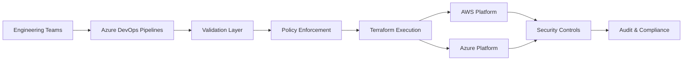

<h1 align="center">Agustín J. Wawrzyk</h1>

  <b>Cloud Architect | DevOps Tech Lead | SecDevOps</b>

Designing secure, governed and scalable cloud platforms across AWS and Azure

  
  
  
  

---

## Architectural Focus

Cloud Architect and DevOps Tech Lead with experience designing and operating enterprise-grade platforms across AWS and Azure.

Focused on building **secure, standardized and scalable cloud ecosystems**, aligning infrastructure engineering with governance, compliance and operational reliability.

My work is centered on:

- Platform standardization across multiple environments and services  
- Infrastructure as Code with enforced governance  
- Deterministic and auditable CI/CD execution models  
- Secure lifecycle management (create / modify / destroy)  
- Alignment with enterprise controls (ISO 27001 / security frameworks)  

---

## Reference Architecture

## Core Capabilities

### Cloud Platforms
- AWS (multi-account strategy, service governance, secure architecture)
- Azure (enterprise subscriptions, RBAC, policy-driven environments)

### Infrastructure as Code
- Terraform modular design (reusable and scalable)
- Workspace isolation strategies
- State management and lifecycle control
- Controlled resource provisioning patterns

### CI/CD Engineering
- Azure DevOps pipeline architecture
- Template standardization and reuse
- Controlled execution flows
- Environment segregation (dev / test / stage / prod)

### Security & Governance
- Policy as Code implementation
- Cloud hardening strategies
- ISO 27001 / ISO 27002 alignment
- Least privilege enforcement
- Pre-deployment validation mechanisms

---

## Design Principles

- Deterministic infrastructure over ad-hoc provisioning  
- Governance embedded by design  
- Controlled blast radius in all operations  
- Validation before execution (inputs, structure, security)  
- Clear separation of concerns across environments  
- Standardization to reduce operational complexity  

---

## Engineering Approach

- Design reusable Terraform modules aligned with enterprise patterns  
- Build pipelines as controlled execution systems, not just automation scripts  
- Enforce naming conventions and structural validation  
- Reduce operational risk through validation and isolation  
- Ensure traceability, auditability and reproducibility  

---

## What differentiates my approach

- Focus on **governed automation**, not just automation  
- Emphasis on **risk reduction and control mechanisms**  
- Infrastructure treated as **testable and verifiable systems**  
- Strong alignment between **engineering and compliance**  
- Design decisions driven by **scalability and long-term maintainability**  

## Enterprise Architecture Experience

- Designing cloud platforms aligned with enterprise governance models  
- Implementing Terraform-based standardization across multiple services  
- Defining CI/CD patterns for large-scale environments  
- Enforcing naming, structure and validation rules across teams  
- Managing infrastructure lifecycle with controlled execution patterns  
- Collaborating with security and compliance teams to align controls  

---

## Design Decisions

- Workspace-based isolation to reduce blast radius  
- Pre-validation layer before Terraform execution  
- Strict naming conventions to avoid ambiguity  
- Separation between pipeline orchestration and infrastructure logic  
- Controlled destroy strategies to prevent unintended resource removal  

---

## Governance Model

- Centralized pipeline control through templates  
- Enforced naming and structural standards  
- Environment-based segregation strategy  
- Validation gates before infrastructure deployment  
- Security and compliance checks integrated into pipelines  

---

## Current Work

- Terraform standardization across AWS and Azure platforms  
- DevSecOps testing strategies (unit, integration, E2E)  
- Pipeline governance and validation layers  
- Secure automation patterns for infrastructure lifecycle  
- AI-assisted DevOps workflows for engineering productivity  

## GitHub Activity

  
  

---

## Contact

---

  <i>Architecture is about designing controlled, predictable and secure systems at scale.</i>

